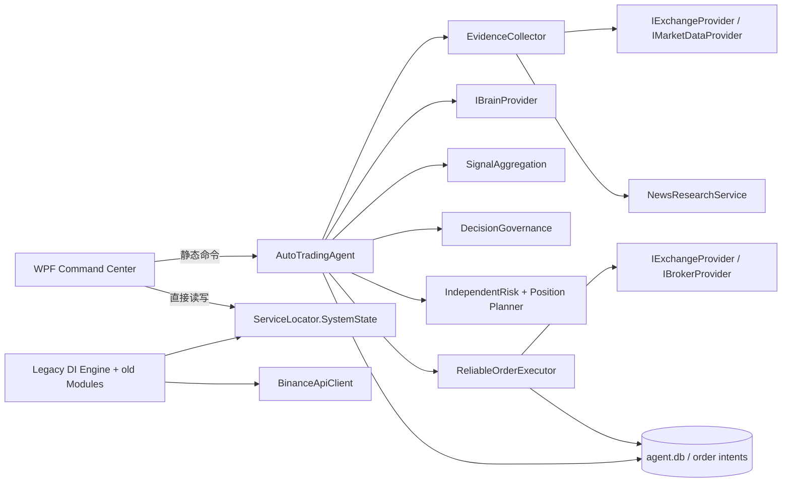
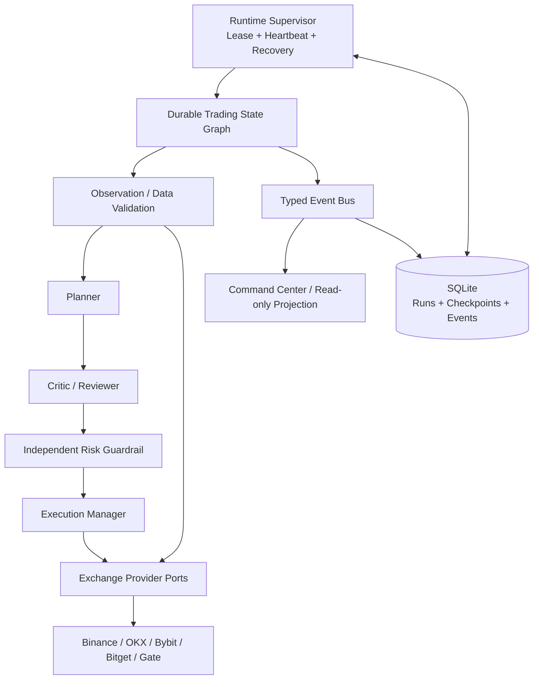

# WPE Agent 3.5 架构审计与底层升级

审计日期：2026-07-20  
审计基线：`d11a45b`（3.4.1）  
范围：170 个 C# 文件、14,491 行 C#、配置、SQLite、日志、测试入口和实际桌面启动链路。

## 1. 审计时的真实运行架构

有效生产闭环已经使用 `IExchangeProvider`、结构化 `EvidencePack`、`DecisionPlan`、`DecisionReview`、`IndependentRiskReview` 和 `ExecutionIntent`；Brain 不直接调用交易 API，风险审查拥有最终否决权，执行使用客户端订单号和持久订单意图实现幂等。

项目同时仍编译一套较早的 DI/页面服务链路。审计发现 20 个文件仍直接引用 `BinanceApiClient` 或旧 Binance 数据服务，主要位于 `Application/Services`、`Services/Execution` 和旧 `Modules` 页面。这些不是 3.5 主交易闭环，但构成维护和误接线风险。

## 2. 数据与运行证据

- 主数据库完整性：`PRAGMA integrity_check = ok`。
- 审计时数据量：83 个决策周期、9 个订单意图、85 个账户快照、1,080 个技能调用、8 个执行事件、4 个闭环交易结果。
- 82 个周期已完成；1 个周期因旧进程中断永久停留在 `RUNNING`。
- 订单意图没有未确认项，说明订单幂等/保护恢复链路有效，但旧周期没有工作流级恢复机制。
- 日志未发现数据库损坏或最近 API 错误。

## 3. 逐项结论

| 检查项 | 3.4.1 结论 | 3.5 处理 |
|---|---|---|
| 模块直接调用 | 主循环集中编排；旧模块耦合较重 | 新增事件总线作为逐步解耦边界 |
| 交易所渗透 | 活跃闭环已适配器化；旧模块仍有 20 处引用 | 主闭环保持零交易所分支，遗留链路列入隔离清单 |
| UI 修改业务状态 | 存在，全局 `SystemState` 是可变对象 | UI 增加只读运行健康投影；完整状态投影迁移留到下一阶段 |
| Brain 直接交易 | 不存在 | 状态图进一步禁止 Planner 越过 Critic/Risk 到 Execution |
| 重复状态 | 数据库、全局 UI 状态、旧服务内部状态并存 | 工作流真实状态以 SQLite 检查点为准，UI 只展示投影 |
| 内存状态不可恢复 | 周期阶段、当前节点、运行身份不可恢复 | 新增运行、节点和阶段检查点 |
| 长任务重启丢失 | 存在，已留下 1 个永久 `RUNNING` 周期 | 启动时迁移旧周期、核对订单后恢复并重新观察行情 |
| 大模型阻塞安全处理 | 大模型阻塞单个主周期，紧急平仓独立；无独立心跳 | 心跳与租约独立运行，技能有可取消超时 |
| 自然语言协议 | 核心交易对象已结构化；日志/解释仍是文本 | 事件协议改为类型、事件名、关联 ID 和 JSON 载荷 |
| 幂等和审计 | 订单较完整，工作流不足 | 新增工作流检查点与运行事件审计 |
| 回测/模拟/实时同逻辑 | 尚未完全统一，旧回测链路不同 | 未伪装完成；列为后续最高优先级之一 |
| 单一固定循环 | 是 | 保留确定性交易内核，拆出心跳、事件派发与恢复监督 |
| 工具权限 | 只有元数据，无运行时强制 | 新增 `SkillExecutionGuard`，拒绝未注册、主网及危险权限 |
| 交易所状态偏差 | 启动和每周期核对账户/订单，执行恢复较完整 | 重启恢复现在先核对订单，再允许新风险 |

## 4. 3.5 目标架构

状态图的关键约束是 `Planner -> Critic -> Risk -> Execution`，任何越级调用都会抛出错误。无订单时 `Risk -> Reflection`；有订单时才进入 `Execution`。恢复策略不会盲目重放外部副作用：先通过客户端订单 ID 和交易所状态核对执行结果，再从新鲜行情重新进入 Observation。

## 5. 借鉴的设计思想

- LangGraph：按节点保存 checkpoint、以运行 ID/周期 ID 组织持久状态、失败后从最后可靠边界恢复。
- AutoGen：异步事件传递和故障订阅者隔离，但不引入额外 Python/.NET 框架依赖。
- OpenAI Agents SDK：结构化 guardrail、session/run 标识和 trace correlation；不保存隐藏推理。
- NautilusTrader：Data/Event/Command 分离思想、确定性顺序事件内核、网络 I/O 与核心调度隔离、端口与适配器。
- QuantConnect LEAN：信号、组合/仓位、风险和执行职责分层。
- Hummingbot：In-Flight Order、本地订单追踪、用户数据流与交易所状态核对。
- Bailongma 方向：采用持续心跳、焦点化上下文、任务续跑和记忆压缩思想；本次未引入来源不明确的第三方代码。

官方参考：

- https://docs.langchain.com/oss/python/langgraph/persistence
- https://microsoft.github.io/autogen/stable/user-guide/core-user-guide/index.html
- https://openai.github.io/openai-agents-python/agents/
- https://openai.github.io/openai-agents-python/guardrails/
- https://nautilustrader.io/docs/latest/concepts/message_bus/
- https://www.quantconnect.com/docs/v2/writing-algorithms/algorithm-framework/overview
- https://hummingbot.org/connectors/connectors/architecture/

## 6. 仍需分阶段清理的客观遗留

1. 将旧 `BinanceApiClient` 页面和旧 Execution 服务迁移到 Provider 端口，随后从生产编译中隔离旧链路。
2. 用不可变快照/投影彻底替换 `ServiceLocator.SystemState` 的跨线程共享可变状态。
3. 让回测、模拟盘和 Testnet 共用同一事件、时钟、风险与执行语义，消除两套业务逻辑。
4. 把单文件静态 `AutoTradingAgent` 拆成可注入的 Data Engine、Decision Engine、Risk Engine、Execution Engine；迁移过程中保持现有闭环行为不变。
5. 增加崩溃点矩阵测试：每个节点前后终止进程，验证恢复不会重复下单。

这些遗留不影响 3.5 新增的检查点、租约、心跳、恢复和权限 Guardrail，但在删除旧架构前仍需保留在审计清单中。
