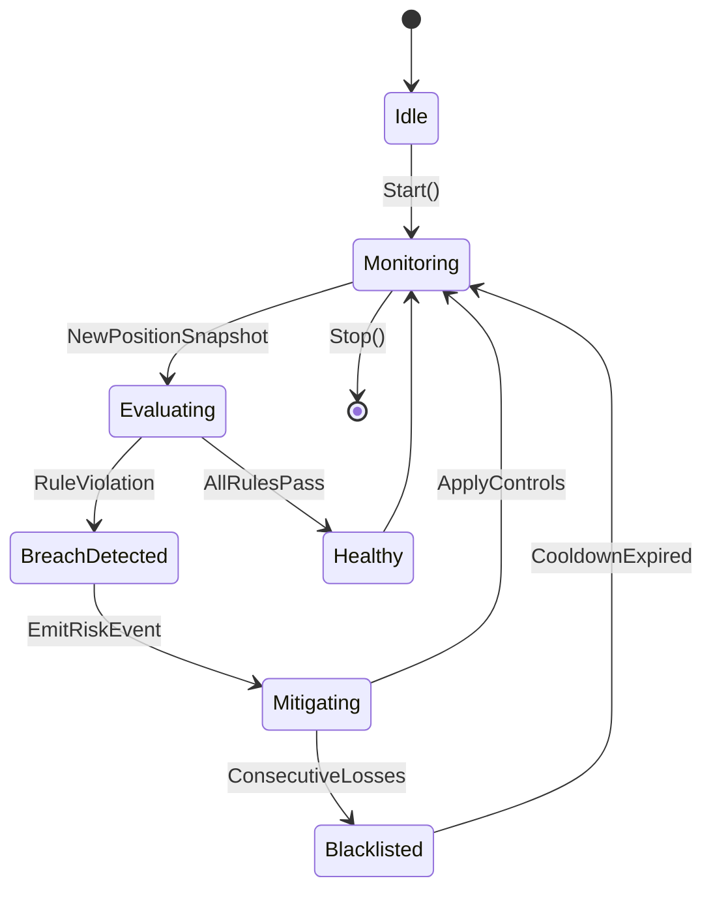
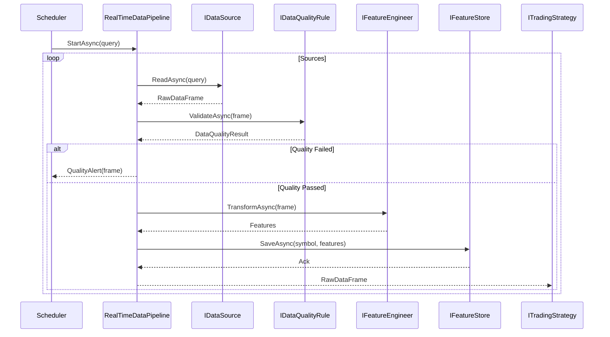

# 优化后架构总览

```mermaid
graph LR
    UI[WPF & ASP.NET Core 前端]
    Orchestrator[策略编排
(StrategyOrchestrator)]
    Pipeline[数据处理流水线
(RealTimeDataPipeline)]
    Risk[风险子系统
(RiskManager)]
    ML[机器学习信号
(RandomForestSignalGenerator)]
    Backtest[回测与优化
(WalkForwardOptimizer)]
    DataSources[多数据源
(Database/API/File)]
    Monitoring[监控与告警
(InMemoryTradeMonitoringHub)]

    UI --> Orchestrator
    Orchestrator --> Pipeline
    Orchestrator --> Risk
    Orchestrator --> ML
    Orchestrator --> Monitoring
    Pipeline --> DataSources
    Pipeline --> ML
    Risk --> Monitoring
    Orchestrator --> Backtest
    Backtest --> Pipeline
```

- **模块化策略框架**：`MeanReversionStrategy` 和 `MomentumStrategy` 基于 `ITradingStrategy` 协议，支持均值回归 + 动量组合、ML 信号与多时间框架。
- **可扩展数据层**：`RealTimeDataPipeline` 聚合数据库、API 与文件数据源，内置质量检测、异常兜底与特征工程。
- **风险闭环**：`RiskManager` 联动动态止损、最大回撤、黑名单、Kelly 资金分配和 VaR 计算，并与监控中心实时通信。
- **工程化能力**：提供参数优化、Walk-Forward、测试样例、Benchmark 入口，支持持续迭代。

## 风险监控状态图



- **Monitoring**：`RiskManager.UpdateAsync` 接收 `PositionSnapshot`，触发每条 `IRiskRule` 校验。
- **Evaluating**：`DynamicStopLossRule`、`MaxDrawdownRule` 等返回 `RiskRuleResult`，一旦失败进入 `BreachDetected`。
- **Mitigating**：通过 `RiskTriggered` 事件告知前端或监控面板，并调用 `BlacklistManager`、`KellyAllocator` 等执行控制。

## 数据管道序列图



- **多源接入**：`DatabaseDataSource`、`ApiDataSource` 与 `FileDataSource` 并行推送 K 线或 tick。
- **质量监控**：`NullValueQualityRule`、`RangeQualityRule`、`SpikeDetectionRule` 在流式校验失败时回传质量告警。
- **特征工程**：`TechnicalIndicatorEngineer` 与 `LagFeatureEngineer` 自动构建特征并落地至 `IFeatureStore`，供策略与 ML 模块消费。
- **错误兜底**：任一阶段抛出异常时由 `DataPipelineException` 捕获并写入监控通道。
```
