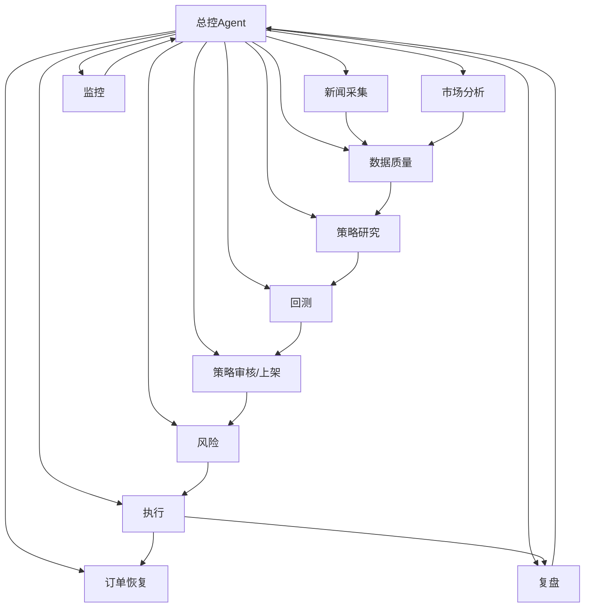

# WPE Agent 本地优先多Agent设计

## 1. 总体原则
- 本地优先：行情、新闻抓取、数据校验、订单恢复、风控、执行、审计必须可离线确定性运行。
- LLM 只做建议与抽象：不直接持有交易权限，不直接下单，不直接改状态。
- 角色单一职责：每个Agent只对一种状态转移负责。
- 所有决策可追溯：输入、规则命中、模型建议、最终动作都写入审计日志。

## 2. 组织图


## 3. 角色卡
### 总控Agent
- 输入：各Agent事件、系统告警、状态快照
- 输出：编排指令、优先级、降级/恢复命令
- 权限：只读全局状态；可调度，不可越权交易
- 状态机：`Healthy -> Degraded -> Halted`
- LLM：可选，用于解释复杂冲突；默认规则驱动
- 失败降级：切换到静态调度表，冻结非关键流程

### 新闻采集
- 输入：源列表、关键词、时间窗
- 输出：结构化新闻事件、来源可信度、去重指纹
- 权限：只读外部源
- 状态机：`Idle -> Fetching -> Parsed -> Deduped -> Emitted`
- LLM：可选，仅用于摘要与实体归一
- 失败降级：保留原文与抓取失败原因，禁止空摘要冒充事实

### 市场分析
- 输入：行情、盘口、成交、宏观数据
- 输出：因子、特征、 regime 标签、异常提示
- 权限：只读市场数据
- 状态机：`Idle -> Compute -> Validate -> Emit`
- LLM：可选，仅用于研究解释
- 失败降级：输出空结果并标记不可用，不猜测

### 数据质量
- 输入：新闻、行情、特征、策略数据集
- 输出：质量评分、缺失/漂移/延迟报告、可用性标记
- 权限：只读数据管道
- 状态机：`Scan -> Score -> Flag -> Gate`
- LLM：不建议，优先规则
- 失败降级：任何关键字段不合格即阻断下游

### 策略研究
- 输入：新闻/市场/质量合格数据、策略假设
- 输出：策略候选、特征说明、参数草案
- 权限：读历史数据；不可写生产配置
- 状态机：`Hypothesis -> Generate -> Filter -> Propose`
- LLM：可选，用于假设生成与论文式归纳
- 失败降级：仅保存候选，不进入生产

### 回测
- 输入：策略候选、历史数据、成本模型
- 输出：绩效指标、稳健性报告、失败案例
- 权限：只读历史；写回测结果库
- 状态机：`Prepare -> Run -> Score -> Publish`
- LLM：不需要
- 失败降级：回测参数不可复现时直接失败

### 策略审核/上架
- 输入：回测报告、策略说明、风控约束
- 输出：上架/拒绝/待补充，版本号
- 权限：可写策略注册表，不能改执行参数
- 状态机：`Review -> Check -> Decide -> Register`
- LLM：可选，仅用于审核意见归纳
- 失败降级：默认拒绝

### 风险
- 输入：策略、仓位、敞口、订单、异常
- 输出：限额、拦截、降杠杆、熔断
- 权限：最高本地控制权，可拦截执行
- 状态机：`Monitor -> Evaluate -> Block/Allow -> Escalate`
- LLM：不建议，必须规则优先
- 失败降级：默认阻断

### 执行
- 输入：已批准策略、风控许可、目标仓位
- 输出：订单指令、成交回报、执行成本
- 权限：受风控约束的交易写权限
- 状态机：`Armed -> Submit -> PartialFill -> Filled/Cancel`
- LLM：不需要
- 失败降级：撤单并冻结，等待恢复

### 订单恢复
- 输入：订单状态、成交回报、交易所回执、断线事件
- 输出：重放计划、状态修复、人工介入请求
- 权限：可读写订单状态机，不可新开风险敞口
- 状态机：`Detect -> Reconcile -> Replay -> Confirm`
- LLM：不需要
- 失败降级：进入人工确认

### 复盘
- 输入：交易日志、执行成本、策略表现、异常事件
- 输出：归因、改进清单、下轮实验建议
- 权限：只读历史与审计
- 状态机：`Collect -> Attribute -> Summarize -> Recommend`
- LLM：可选，用于总结与归纳
- 失败降级：仅输出事实，不输出结论

### 监控
- 输入：全链路指标、日志、心跳、告警
- 输出：告警、SLA、健康分、自动升级事件
- 权限：只读遥测，触发告警与停机建议
- 状态机：`Observe -> Detect -> Alert -> Escalate`
- LLM：不需要
- 失败降级：本地规则告警优先

## 4. 确定性本地服务 vs 可选LLM
### 必须确定性本地服务
- 数据抓取与缓存
- 去重、时间戳校准、实体解析的基础规则
- 数据质量校验
- 风险限额与熔断
- 下单、撤单、恢复、重放
- 审计、签名、版本管理
- 监控与告警

### 可选LLM
- 新闻摘要
- 研究假设生成
- 策略说明书整理
- 复盘文字总结
- 审核意见润色

### 禁止LLM直控
- 交易执行
- 风控放行
- 数据合格性判定
- 订单重放确认

## 5. 消息契约
### 统一事件头
```json
{
  "event_id": "uuid",
  "event_type": "string",
  "agent": "string",
  "ts": "RFC3339",
  "trace_id": "uuid",
  "correlation_id": "uuid",
  "schema_version": "1.0"
}
```

### 统一载荷字段
- `input_refs`: 上游输入引用
- `facts`: 结构化事实
- `signals`: 计算结果
- `confidence`: 0-1
- `decision`: `allow | block | review | retry | escalate`
- `reason_codes`: 机器可读原因码
- `artifacts`: 文件/表/回测ID

## 6. 状态机与降级
- 所有Agent必须有 `Idle -> Running -> Succeeded/Failed -> Archived`
- 遇到外部依赖失败时只允许 `Retry` 或 `Degrade`
- 遇到数据不一致时下游全部停在 `Blocked`
- 风险和执行默认失败即停，不自动乐观恢复

## 7. 小模型/规则/LLM 三级路由
### 路由原则
1. 规则优先：格式校验、阈值、白黑名单、状态机判断
2. 小模型其次：分类、打分、实体归一、摘要压缩
3. LLM 最后：研究、解释、生成草案

### 典型路由
- 新闻去重：规则 + 小模型
- 事件分类：小模型
- 策略假设：LLM
- 风险决策：规则
- 复盘文本：LLM

## 8. 技能蒸馏流程
1. 从人工/LLM产物生成高质量样本。
2. 用规则和标签体系把样本结构化。
3. 蒸馏到小模型做分类、抽取、排序。
4. 小模型输出再由规则门控。
5. 只有通过门控的结果才能进入生产。
6. 失败样本回流到复盘库和再训练集。

## 9. 记忆边界
- 总控只记全局状态和编排结果，不记研究细节。
- 研究与复盘只记方法、样本、结论，不记交易权限。
- 执行与恢复只记订单生命周期，不记策略推理。
- 风险只记规则命中与限额历史，不记主观意见。
- LLM 记忆只保留工作上下文，不进入长期真源。

## 10. 审计
- 每次状态转移记录：谁触发、依据、输入、输出、版本、签名。
- 每次 LLM 调用记录：提示词摘要、输出摘要、采纳结果。
- 每次交易动作记录：风控签名、执行时刻、回报、撤单原因。
- 审计日志不可覆盖，只追加。

## 11. 30天实现顺序
### 第1周
- 定义事件契约、状态机、审计格式
- 落地监控、风控、数据质量三类确定性服务

### 第2周
- 落地新闻采集、市场分析、订单恢复
- 建立消息总线与本地存储

### 第3周
- 落地策略研究、回测、审核/上架
- 接入小模型路由

### 第4周
- 落地总控编排、复盘闭环、LLM辅助层
- 完成技能蒸馏与回流机制

## 12. 最小上线门槛
- 风控可独立断言“停”
- 执行可独立回滚
- 订单恢复可重建状态
- 审计可追责到事件级
- LLM 失败时系统仍可运行
